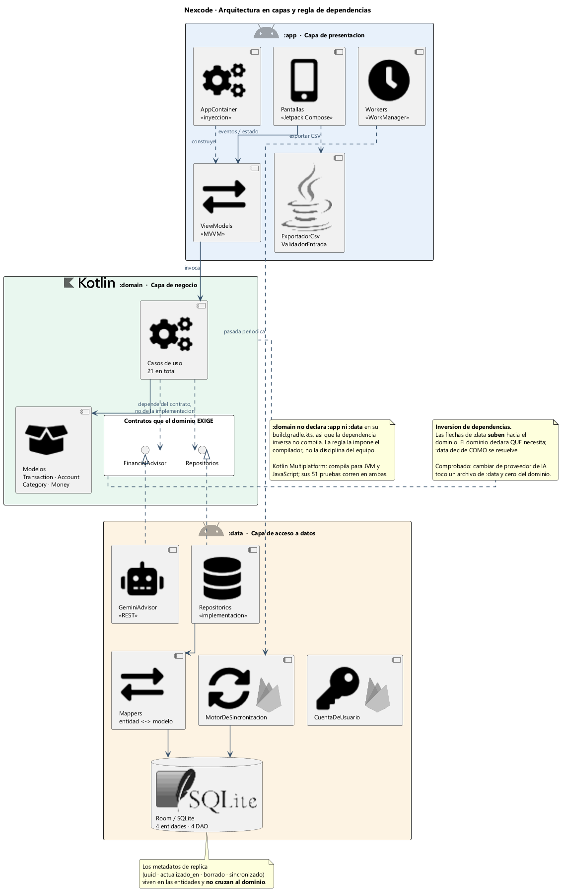
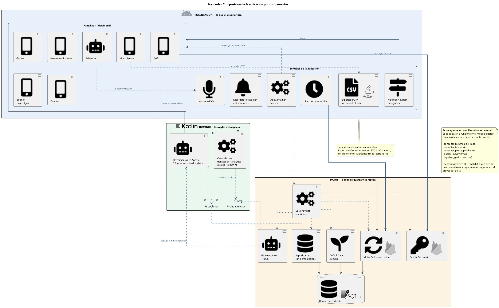
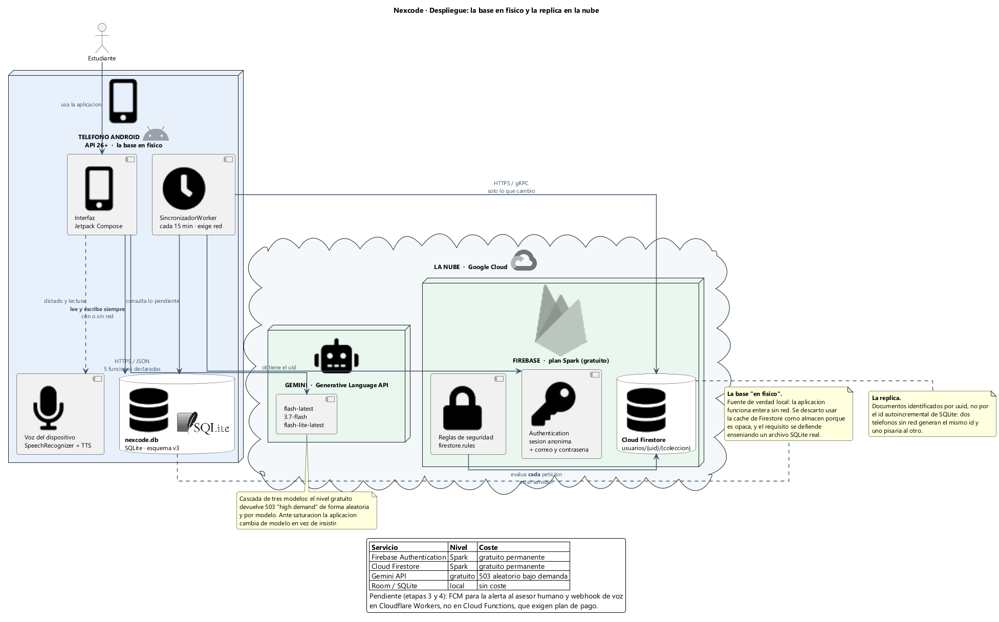
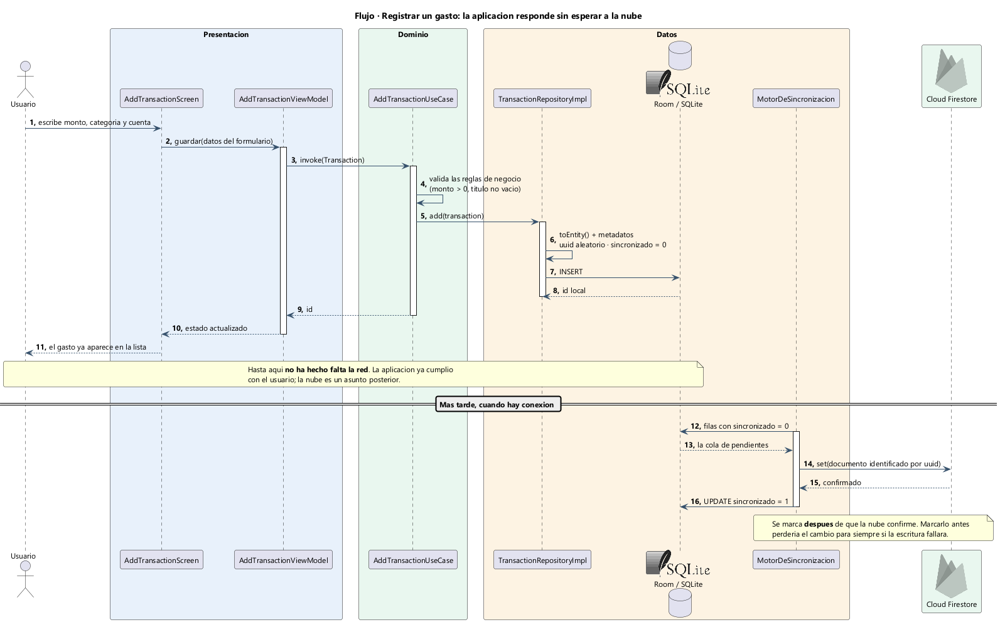
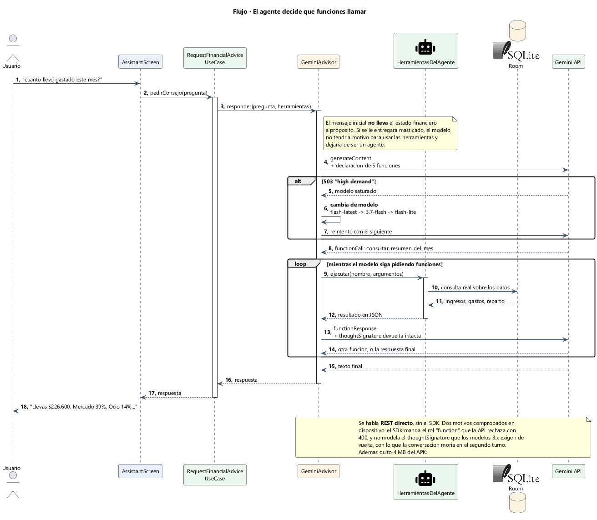
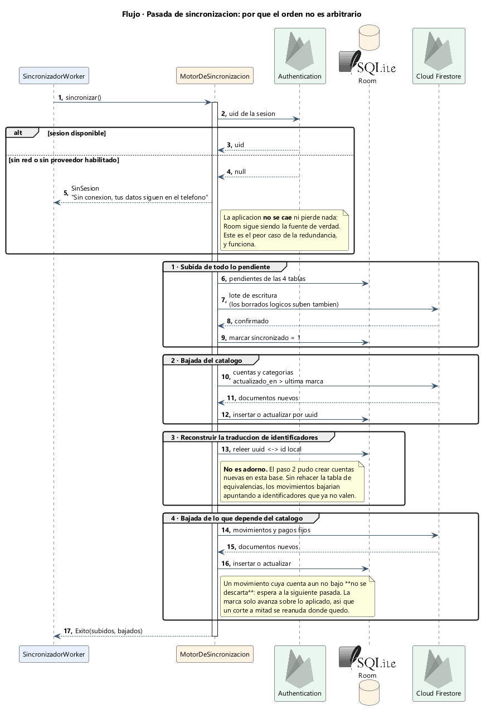
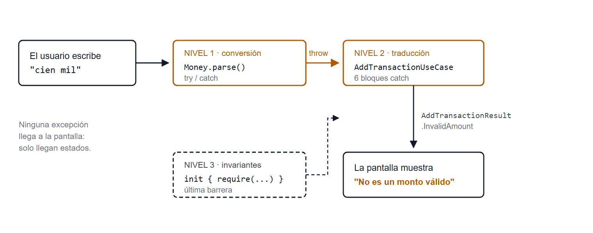

# Nexcode · Control de Gastos Personales

Aplicación Android nativa para el control de gastos personales, dirigida a
estudiantes universitarios colombianos. Opera **íntegramente en el dispositivo**:
no requiere cuenta de usuario ni envía datos a ningún servidor.

**Proyecto Integrador** · Optativa II — Desarrollo Móvil
Universidad de San Buenaventura · Ingeniería de Sistemas
Jeferson Wilderman González Tenjo · José Leandro Ocampo Camacho

> 📘 Manual de uso e instalación: **[`LEEME.md`](LEEME.md)**
> 📐 Por qué está construido así: **[`CONTEXTO-DEL-PROYECTO.md`](CONTEXTO-DEL-PROYECTO.md)**

---

## El proyecto en números

```
111 archivos Kotlin/Java        13 897 líneas
21 casos de uso                 51 pruebas unitarias, 0 fallos
Base de datos Room v3           APK de publicación 1,7 MB (R8)
```

## Arquitectura



### Tres módulos Gradle

La regla de dependencias es **`app → domain ← data`**, y no es una convención de
papel: **la verifica el compilador**. El módulo `:domain` no puede importar nada de
`:app` ni de `:data` porque sencillamente no los declara.

| Módulo | Qué contiene | Depende de |
|---|---|---|
| `app/` | Pantallas en Jetpack Compose, ViewModels, navegación, notificaciones y asistente de voz | `domain`, `data` |
| `domain/` | **Kotlin puro, sin Android.** Modelos, casos de uso y contratos de repositorio | nada |
| `data/` | Room, entidades, DAO y análisis financiero. Expone una sola clase pública: `DataProvider` | `domain` |

`:domain` es un módulo **Kotlin Multiplatform**: compila para JVM *y* JavaScript, y
sus 51 pruebas se ejecutan en ambos destinos. Mantener la lógica de negocio libre de
Android no fue decorativo — es lo que permite probarla sin emulador, en segundos.

## Cómo funciona por dentro

| | |
|---|---|
|  |  |
| **Composición de la interfaz** | **Infraestructura y persistencia** |

### Registrar una transacción



### El asistente de voz



### Sincronización



---

## Una decisión que vale la pena mirar: los errores no viajan como excepciones



Ninguna excepción llega a la pantalla. `Money.parse()` convierte, el caso de uso
traduce el fallo a un estado (`AddTransactionResult.InvalidAmount`) y el `init` del
modelo actúa como última barrera. La interfaz solo recibe estados, nunca excepciones.

---

## Funcionalidades

Más allá del registro de ingresos y gastos:

- **Asistente de voz** (`presentation/voz/`) — registrar un gasto dictándolo
- **Asistente conversacional** (`presentation/assistant/`) con herramientas propias
- **Transacciones recurrentes** (`presentation/recurring/`)
- **Múltiples cuentas** y saldos independientes (`presentation/accounts/`)
- **Exportación** de los movimientos (`exportacion/`)
- **Notificaciones** y recordatorios (`notificaciones/`)
- **Sincronización** opcional (`sincronizacion/`)
- **Análisis de tendencias** y resumen por categoría

## Compilar

Abre la carpeta que contiene `settings.gradle.kts` en **Android Studio**.

Requisitos verificados: **JDK 21**, Android SDK **API 35**, Gradle 8.14.5.

```bash
./gradlew :domain:allTests      # las 51 pruebas, en JVM y JS
./gradlew assembleRelease       # APK de publicación
```

`local.properties` no se versiona: Android Studio lo regenera apuntando al SDK de
tu equipo.

## Descargar el APK

El APK compilado está publicado en la sección **[Releases](../../releases)** de este
repositorio, no en el historial de git.

## Qué no está en el repositorio

| Excluido | Motivo |
|---|---|
| `*.jks`, `keystore.properties` | Claves de firma de publicación |
| `local.properties` | Ruta del SDK, propia de cada equipo |
| `google-services.json` | Configuración de Firebase del proyecto original |
| `build/`, `.gradle/` | Artefactos de compilación |
| `*.apk` | Se publican como Releases |
