# Automatización del proyecto integrador con Make

**Optativa II** — ING. Jairo Armando Salcedo Aranda
**Proyecto:** Nexcode · Control de Gastos Personales (Android / Kotlin)
**Autores:** Jeferson Wilderman González Tenjo · José Leandro Ocampo Camacho
**Fecha de ejecución:** 30 de septiembre de 2026

---

## 1. Descripción de la automatización

### Nombre

**Registro de movimiento en la nube** — escenario
`NEXCODE Gastos - Registro de movimiento (App a Sheets y Gmail)`.

### Problema que resuelve

Nexcode guarda los gastos en una base **local** del teléfono (Room). Eso deja
tres huecos que el usuario resuelve a mano, uno por uno:

| Hueco | Lo que toca hacer hoy |
|---|---|
| **No hay respaldo inmediato** | Si el teléfono se pierde, se pierden los movimientos no sincronizados. |
| **No hay copia consultable fuera del teléfono** | Para revisar los gastos en el computador hay que exportar el CSV a mano. |
| **No hay constancia de lo registrado** | El usuario no tiene un comprobante de qué anotó ni cuándo. |

Los tres nacen del mismo hecho repetitivo: **cada vez que se registra un gasto
hay que volver a hacer lo mismo**. Es exactamente el tipo de tarea que pide
automatizar la guía.

### Proceso que automatiza

En el momento en que el usuario pulsa **Guardar** en el formulario de
*Nuevo movimiento*, la aplicación avisa a Make y este, sin intervención humana:

1. escribe el movimiento en una **bitácora en Google Sheets**, y
2. envía al usuario un **correo de confirmación** con el detalle.

### Por qué esta y no otra

Es el evento **más frecuente** de toda la aplicación —un gasto se registra
varias veces al día, mientras que crear una cuenta o una categoría pasa una vez
al mes—, así que es donde el ahorro se nota. Y sobre todo: nace de una acción
real del usuario dentro de la app, que es la condición del punto 8 de la guía.

---

## 2. Diagrama del proceso

```
  ┌─────────────────────────────┐
  │   APLICACIÓN NEXCODE        │
  │   (Android · Kotlin)        │
  │                             │
  │   Nuevo movimiento          │
  │   → pulsa "Guardar"         │
  └──────────────┬──────────────┘
                 │  HTTP POST (JSON, 11 campos)
                 ▼
  ┌─────────────────────────────┐
  │   TRIGGER                   │
  │   Webhooks · Custom webhook │   ← módulo 1
  │   "WEBHOOK GASTOS NEXCODE"  │
  └──────────────┬──────────────┘
                 │
                 ▼
  ┌─────────────────────────────┐
  │   ACCIÓN 1                  │
  │   Google Sheets · Add a Row │   ← módulo 2
  │   BITACORA DE GASTOS        │
  └──────────────┬──────────────┘
                 │
                 ▼
  ┌─────────────────────────────┐
  │   ACCIÓN 2                  │
  │   Gmail · Send an email     │   ← módulo 3
  │   Confirmación al usuario   │
  └──────────────┬──────────────┘
                 │
                 ▼
  ┌─────────────────────────────┐
  │   RESULTADO                 │
  │   Fila en la bitácora       │
  │   + correo en la bandeja    │
  └─────────────────────────────┘
```

En los términos que pide la guía:

`Registro de gasto → Webhook → Google Sheets → Gmail → Confirmación`

---

## 3. Escenario en Make

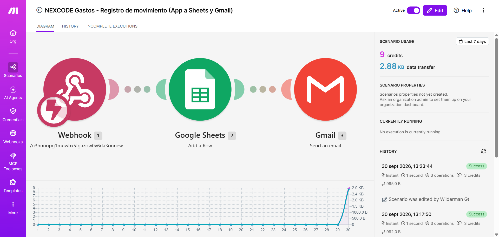


| Dato | Valor |
|---|---|
| Escenario | `NEXCODE Gastos - Registro de movimiento (App a Sheets y Gmail)` |
| ID | `6461166` |
| Enlace | https://us2.make.com/2972430/scenarios/6461166 |
| Programación | **Immediately as data arrives** (instantáneo, no por reloj) |
| Estado | **Activo** |
| Costo por movimiento | 3 operaciones / 3 créditos |

Cumple el mínimo que exige la guía: **1 disparador y 2 acciones**.

---

## 4. Configuración de los módulos

### Módulo 1 · Webhooks — *Custom webhook*

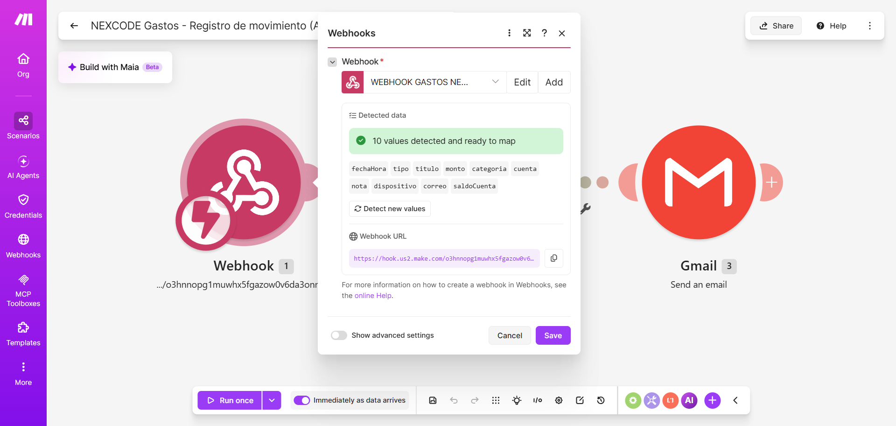
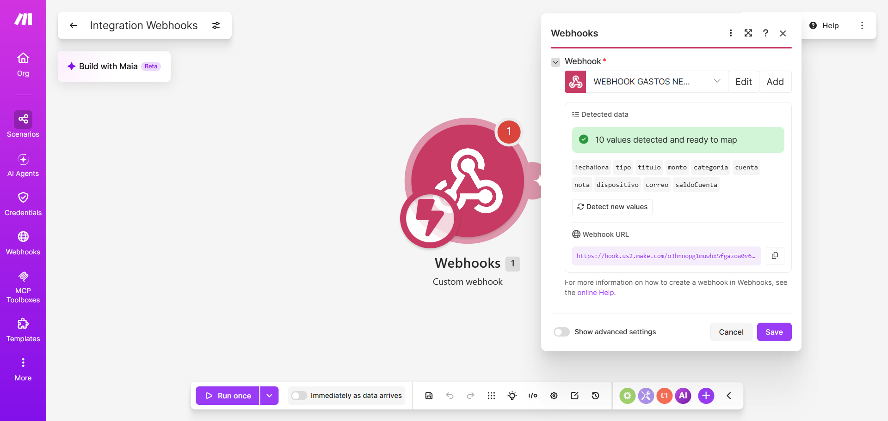

| Campo | Valor |
|---|---|
| Nombre | `WEBHOOK GASTOS NEXCODE` |
| URL | `https://hook.us2.make.com/o3hnnopg1muwhx5fgazow0v6da3onnew` |
| Estructura detectada | **10 campos** listos para mapear |

Los campos que viajan desde la app:

```json
{
  "fechaHora":   "2026-09-30 18:23",
  "tipo":        "Gasto",
  "titulo":      "Matricula semestre VII",
  "monto":       "$ 132.500",
  "montoNumero": 132500,
  "categoria":   "Servicios",
  "cuenta":      "Ahorro universidad",
  "nota":        "Pago en linea desde la app Nexcode",
  "saldoCuenta": "0",
  "correo":      "wildermangt@gmail.com",
  "dispositivo": "sdk_gphone64_x86_64 - Android 15"
}
```

> **Por qué el monto viaja dos veces.** `monto` es el texto ya formateado y es
> el que se lee en el correo; `montoNumero` son los pesos como entero y es el
> que va a la hoja. Mandando solo el texto, Google Sheets lee el punto de los
> miles como separador decimal y guarda **85** en vez de **85000**: la columna
> deja de poder sumarse. Está documentado abajo, en «Problemas encontrados».

### Módulo 2 · Google Sheets — *Add a Row*

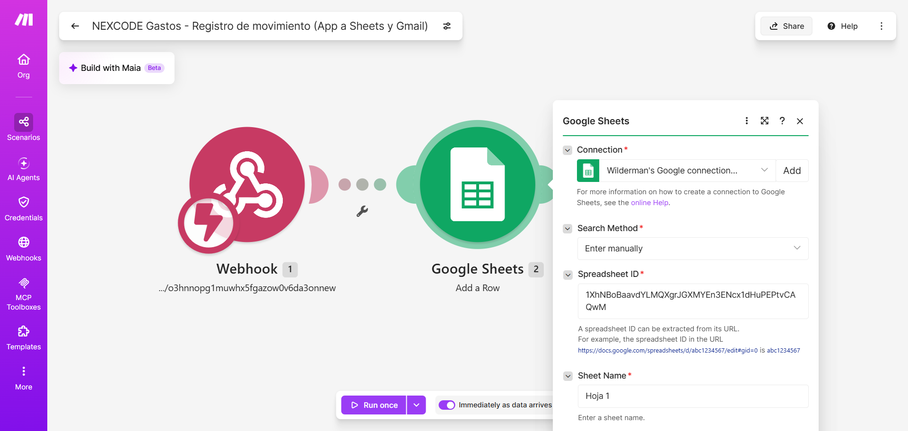
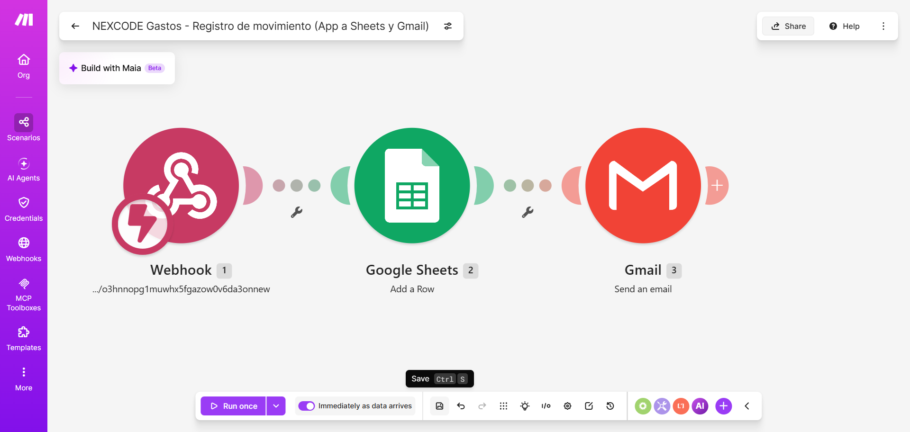
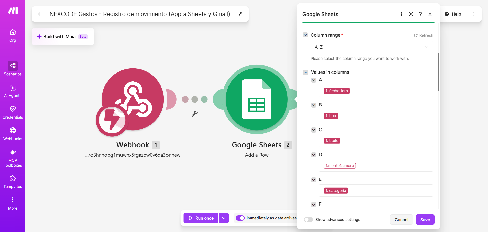

| Campo | Valor |
|---|---|
| Search Method | `Enter manually` |
| Spreadsheet ID | `1XhNBoBaavdYLMQXgrJGXMYEn3ENcx1dHuPEPtvCAQwM` |
| Sheet Name | `Hoja 1` |
| Column range | `A-Z` |

Mapeo columna por columna:

| Columna | Encabezado | Variable del webhook |
|---|---|---|
| A | Fecha y hora | `{{1.fechaHora}}` |
| B | Tipo | `{{1.tipo}}` |
| C | Titulo | `{{1.titulo}}` |
| D | Monto | `{{1.montoNumero}}` |
| E | Categoria | `{{1.categoria}}` |
| F | Cuenta | `{{1.cuenta}}` |
| G | Nota | `{{1.nota}}` |
| H | Dispositivo | `{{1.dispositivo}}` |

> Se eligió **`Enter manually`** en vez del selector de archivos de Drive: así
> el ID queda escrito en la configuración y no depende de navegar por carpetas.

### Módulo 3 · Gmail — *Send an email*

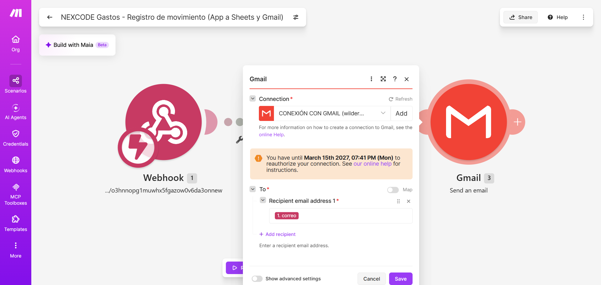
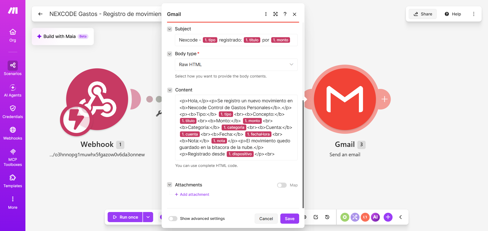

| Campo | Valor |
|---|---|
| To | `{{1.correo}}` — el correo de la sesión del usuario |
| Subject | `Nexcode - {{1.tipo}} registrado: {{1.titulo}} por {{1.monto}}` |
| Body type | `Raw HTML` |
| Content | Tipo, concepto, monto, categoría, cuenta, fecha y nota |

---

## 5. Integración con la aplicación

Esta es la parte que la guía marca como **condición importante**: la
automatización no puede quedarse en un escenario dibujado en Make. Aquí la app
llama al webhook de verdad.

### Lo que se agregó al proyecto

| Archivo | Qué hace |
|---|---|
| `app/.../automatizacion/AvisoDeMovimiento.kt` | **Nuevo.** Arma el JSON y hace el POST al webhook. |
| `app/.../presentation/addtransaction/AddTransactionViewModel.kt` | Llama al aviso cuando el guardado sale bien. |
| `app/.../di/AppContainer.kt` | Conecta las dos piezas y resuelve el correo de la sesión. |
| `app/.../presentation/util/Formato.kt` | Formato de fecha `yyyy-MM-dd HH:mm` para la bitácora. |

### Tres decisiones de diseño que vale la pena sustentar

**1. Sin librería de red.** Se usa `HttpURLConnection` del propio JDK. Es una
sola petición POST: no justifica sumar Retrofit ni OkHttp al APK. Además
encaja con la restricción del proyecto de que todo quepa en el nivel gratuito
y sin peso extra.

**2. El aviso no puede tumbar el gasto.** `enviar()` devuelve un booleano en vez
de lanzar excepción, y se llama **después** de marcar el movimiento como
guardado:

```kotlin
is AddTransactionResult.Success -> {
    _uiState.update { it.copy(isSaving = false, saved = true) }
    // Solo las altas se avisan: una edicion no es un movimiento
    // nuevo y duplicaria la fila en la bitacora de la nube.
    if (editingId == null) avisarDeLaAlta(result, state)
}
```

Si el teléfono está sin datos, el gasto **ya quedó guardado en la base local** y
lo único que se pierde es la copia en la nube. El usuario no ve ningún error
porque, desde su punto de vista, no hubo ninguno.

**3. El ViewModel no conoce el webhook.** Recibe una función, no el objeto:

```kotlin
private val avisarMovimiento: suspend (MovimientoParaAviso) -> Unit = {},
private val correoDestino: () -> String = { AvisoDeMovimiento.CORREO_POR_DEFECTO }
```

Por omisión no hace nada, así que las pruebas del formulario siguen corriendo
sin tocar la red. Quien enchufa el webhook de verdad es el contenedor:

```kotlin
avisarMovimiento = { AvisoDeMovimiento.enviar(it) },
correoDestino = { container.correoDeLaSesion() }
```

---

## 6. Prueba en vivo

Se ejecutó el 30 de septiembre de 2026 en el emulador **Pixel 6 · Android 15**,
siguiendo los cinco pasos que pide la guía.

### Paso 1 · Ejecutar la acción desde la aplicación

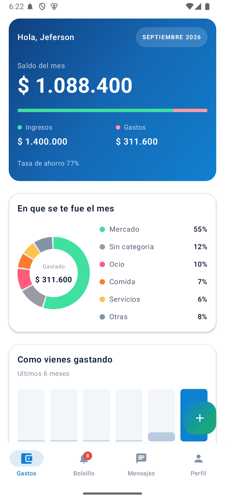

Movimiento registrado:

| Campo | Valor |
|---|---|
| Tipo | Gasto |
| Monto | 132.500 |
| Título | Matricula semestre VII |
| Categoría | Servicios |
| Cuenta | Ahorro universidad |
| Nota | Pago en linea desde la app Nexcode |

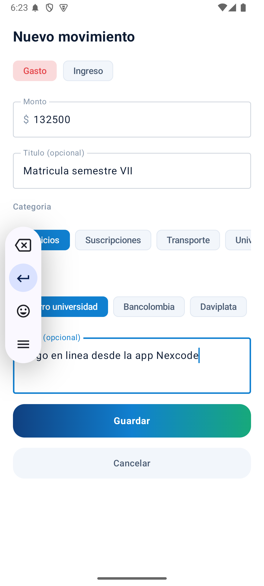
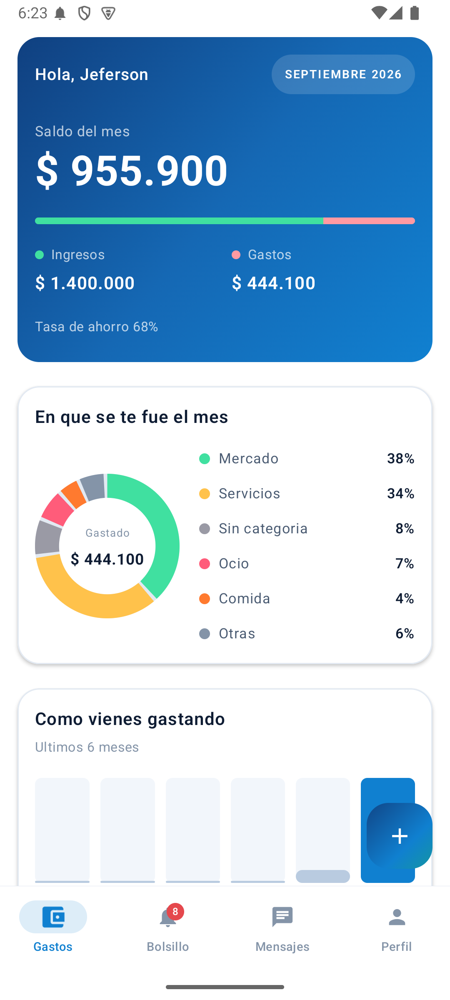

### Paso 2 · Make recibe la información

El registro del propio teléfono confirma que la app llamó al webhook:

```
09-30 18:23:44.547  4593  4652 I AvisoDeMovimiento: Movimiento enviado a Make: Matricula semestre VII
```

*(archivo completo en `registro-logcat.txt`)*

### Paso 3 · Ejecución de los módulos

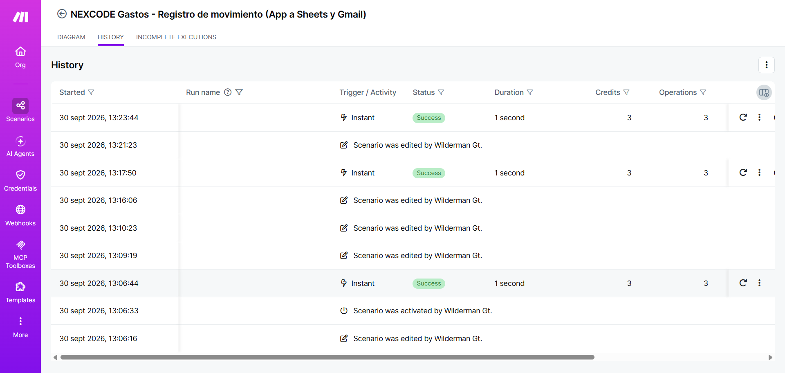

| Hora | Disparador | Estado | Duración | Operaciones |
|---|---|---|---|---|
| 13:23:44 | Instant | **Success** | 1 segundo | 3 |
| 13:17:50 | Instant | **Success** | 1 segundo | 3 |
| 13:06:44 | Instant | **Success** | 1 segundo | 3 |

### Paso 4 y 5 · Datos procesados y resultado final

**Fila escrita sola en la bitácora:**

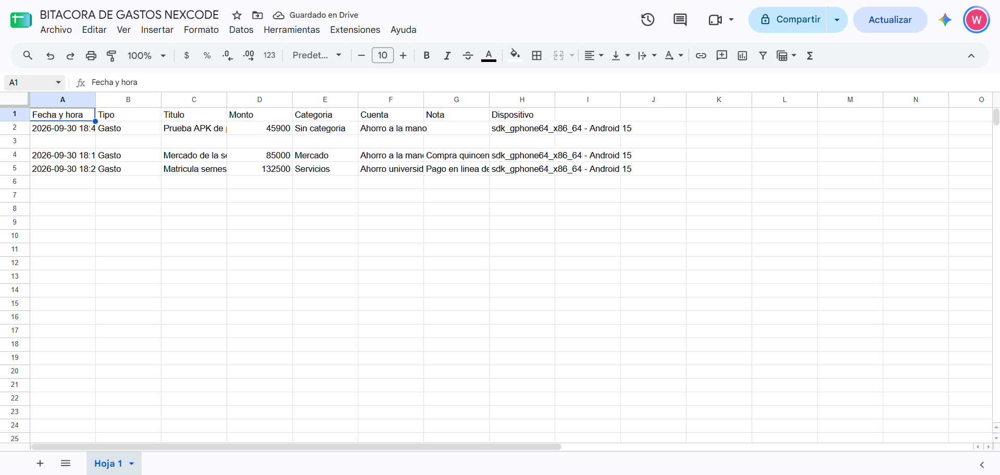

| A | B | C | D | E | F | G | H |
|---|---|---|---|---|---|---|---|
| 2026-09-30 18:23 | Gasto | Matricula semestre VII | 132500 | Servicios | Ahorro universidad | Pago en linea desde la app Nexcode | sdk_gphone64_x86_64 - Android 15 |

**Correo recibido:**

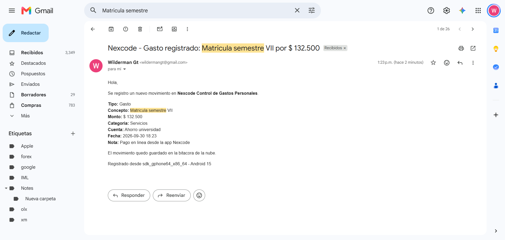

> **Asunto:** Nexcode - Gasto registrado: Matricula semestre VII por $ 132.500
>
> Se registro un nuevo movimiento en **Nexcode Control de Gastos Personales**.
>
> Tipo: Gasto · Concepto: Matricula semestre VII · Monto: $ 132.500
> Categoria: Servicios · Cuenta: Ahorro universidad
> Fecha: 2026-09-30 18:23 · Nota: Pago en linea desde la app Nexcode

**La cadena quedó demostrada de extremo a extremo:**

`App Nexcode → Make → Google Sheets + Gmail → Resultado`

---

## 7. Problemas encontrados y cómo se resolvieron

Vale dejarlos escritos porque ninguno da un error visible: los tres fallan en
silencio y producen un dato equivocado.

### El monto llegaba dividido por mil

La primera prueba mandó `"$ 42.000"` como texto y en la hoja quedó **42**.
Google Sheets leyó el punto de los miles como separador decimal.

**Solución:** la app manda dos campos. `monto` (texto, para el correo) y
`montoNumero` (entero, para la hoja). La columna D se remapeó a
`{{1.montoNumero}}`. Verificado: ahora guarda `132500` y la columna se puede
sumar.

### El correo perdía el final del cuerpo

El editor de campos de Make **se come los últimos caracteres** de lo que se
escribe. Un cuerpo que terminaba en `</p>` quedó en `<` y Gmail se tragó media
firma.

**Solución:** terminar el HTML con relleno inofensivo (`</p><br>`), de modo que
el recorte no toque el contenido.

### El correo mostraba «Cupo de la cuenta: 0»

`Account.initialBalance` es el **cupo** que el usuario fija, no el saldo
disponible; en varias cuentas vale cero. Mostrarlo como «saldo» era engañoso.

**Solución:** se quitó esa línea del correo. El campo sigue viajando en el JSON
por completitud, pero no se muestra. Calcular el disponible de verdad exige
combinar los movimientos y eso vive en otro caso de uso.

---

## 8. Sustentación — las siete preguntas de la guía

La demostración la presentan **Jeferson Wilderman González Tenjo** y
**José Leandro Ocampo Camacho**.

**1. ¿Qué problema identificaron?**
Los gastos viven solo en el teléfono: sin respaldo inmediato, sin copia
consultable desde el computador y sin constancia de lo registrado.

**2. ¿Qué proceso decidieron automatizar?**
El registro de un movimiento, que es la acción más repetida de la aplicación.

**3. ¿Por qué escogieron esa automatización?**
Porque es el evento más frecuente —varias veces al día— y porque parte de una
acción real del usuario dentro de la app, que es lo que exige el punto 8.

**4. ¿Cómo está construido el escenario?**
Tres módulos: un webhook instantáneo como disparador, `Add a Row` de Google
Sheets y `Send an email` de Gmail. Sin routers ni filtros: el flujo es lineal.

**5. ¿Qué información recibe Make?**
Un JSON de 11 campos con el movimiento completo: fecha, tipo, título, monto en
dos formatos, categoría, cuenta, nota, correo del usuario y el modelo del
dispositivo desde el que se registró.

**6. ¿Qué acciones ejecuta?**
Escribe una fila en la bitácora de Google Sheets y envía un correo de
confirmación al usuario.

**7. ¿Cuál es el resultado?**
El usuario recibe su comprobante y queda una bitácora en la nube, consultable
desde cualquier parte y con la columna de montos sumable.

---

## 9. Recursos creados

| Recurso | Ubicación |
|---|---|
| Escenario en Make | https://us2.make.com/2972430/scenarios/6461166 |
| Webhook | `https://hook.us2.make.com/o3hnnopg1muwhx5fgazow0v6da3onnew` |
| Bitácora en Google Sheets | https://docs.google.com/spreadsheets/d/1XhNBoBaavdYLMQXgrJGXMYEn3ENcx1dHuPEPtvCAQwM/edit |

La hoja se creó con ocho encabezados en la fila 1:

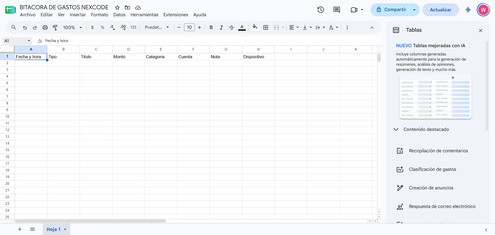
| Registro del dispositivo | `registro-logcat.txt` |
| Capturas | `capturas/` |

Todo dentro del **nivel gratuito**, como exige el criterio del proyecto: Make
plan Free (1.000 créditos/mes; cada movimiento gasta 3) y Google Workspace
personal. No se agregó ninguna dependencia al APK.

> ⚠️ **Cuidado con el cupo.** El escenario está **activo** para la sustentación.
> Como es instantáneo, solo consume cuando la app registra un movimiento: no
> gasta nada en reposo. Aun así conviene apagarlo cuando termine la
> presentación, desde https://us2.make.com/2972430/scenarios
